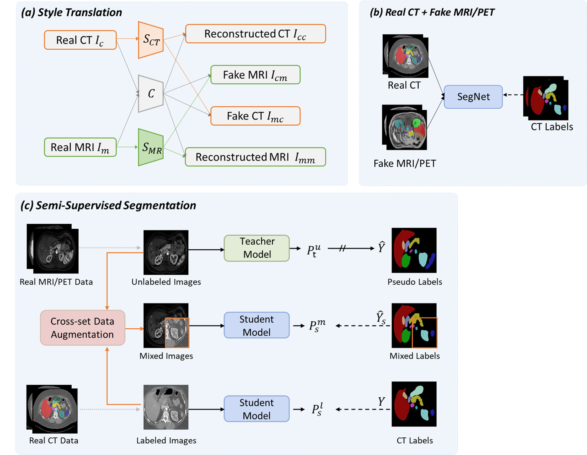

# FLARE24-Task3-LTUDA

## Overview
This work solves the unsupervised cross-modal domain adaptation task by generating synthetic MRI/PET data and adopting a teacher-student semi-supervised training framework with cross-set data augmentation (CDA) (which is proposed by our work [Labeled-to-unlabeled distribution alignment for partially-supervised multi-organ medical image segmentation](https://www.sciencedirect.com/science/article/abs/pii/S1361841524002585)). For details, please see the flowchart below:

<div align=center>

</div>

## Environments and Requirements
* CUDA >= 11.3
* python >= 3.7.13

To set up the environment, follow these steps:

```
conda create -n FLARE python=3.7.13
conda activate FLARE
pip install torch==1.12.1+cu113 torchvision==0.13.1+cu113 torchaudio==0.12.1 --extra-index-url https://download.pytorch.org/whl/cu113
pip install -r requirements.txt
```

## ⚠️ Important Notice

Before starting any training or inference, make sure to modify the base paths in all configuration files:

1. Modify the base paths in `configs/xxx/xxx_base.yaml`:  xxx includes `preprocess`, `train`, `inference`, etc.
```yaml
DATASET:
  BASE_DIR: "your/path/to/datasets"  # Dataset root directory
```

2. All training and inference configuration files inherit from `base.yaml`, so this step is mandatory.

3. Please ensure to use absolute paths instead of relative paths to avoid potential path resolution issues.

## Dataset
The training Data and validation data are provided by the [FLARE25](https://www.codabench.org/competitions/2296/). In short, there are 2050 CT data (50 labeled data and 2000 pseudo-labeled data (we use the pseudo labels provided by blackbean)), 4817 unlabeled MRI data and 1000 unlabeled PET data for training.

```
|-- datasets
|   |-- CT
|   |   |-- CT2MR_image
|   |   |-- CT2MR_label
|   |   |-- CT2PET_image
|   |   |-- CT2PET_label
|   |   |-- CT_image
|   |   `-- CT_label
|   |-- MRI
|   |   |-- PublicValidation
|   |   |   |-- MRI_imagesVal
|   |   |   `-- MRI_labelsVal
|   |   `-- Training
|   |       `-- MRI_image
|   |-- PET
|   |   |-- PublicValidation
|   |   |   |-- PET_imagesVal
|   |   |   `-- PET_labelsVal
|   |   `-- Training
|   |       `-- PET_image
|   |-- processed_data
|   |   `-- fine
|   |       |-- big_segnet
|   |       `-- combined_data
```

## Stage1: Style Translation
Please refer to ["Style_Translation/README.md"](Style_Translation/README.md) for detailed information.

## Stage2: Segmentation using Real CT and Fake MRI/PET Data

### step1: preprosess
```bash
# Process CT dataset
python ./preprocess/data_preprocess.py --cfg ./configs/preprocess/preprocess_step1_CT.yaml

# Process Fake MRI dataset
python ./preprocess/data_preprocess.py --cfg ./configs/preprocess/preprocess_step1_FakeMRI.yaml

# Process Fake PET dataset
python ./preprocess/data_preprocess.py --cfg ./configs/preprocess/preprocess_step1_FakePET.yaml
```
### step2: training
```bash
python train.py --cfg ./configs/train/train_big_segnet_ctl_fakemri.yaml
python train.py --cfg ./configs/train/train_big_segnet_ctl_fakepet.yaml
```

## Stage3: Segmentation using Real CT and Real unlabeled MRI/PET Data

### step1: preprosess
```bash
# Process Real unlabeled MRI dataset
python ./preprocess/data_preprocess_ul_bigsegnet.py --cfg ./configs/preprocess/preprocess_step2_MRIul.yaml

# Process Real unlabeled PET dataset
python ./preprocess/data_preprocess_ul_bigsegnet.py --cfg ./configs/preprocess/preprocess_step2_PETul.yaml
```
### step2: training
```bash
python train_CDA.py --cfg ./configs/train/train_big_segnet_ctl_mriul_CDA.yaml
python train_CDA.py --cfg ./configs/train/train_big_segnet_ctl_petul_CDA.yaml
```

## Inference

To infer the testing cases, run this command:
An experiment of small segnet

```bash
python inference.py --cfg ./configs/inference/inference_big_segnet_mri.yaml 
python inference.py --cfg ./configs/inference/inference_big_segnet_pet.yaml 
```

## Evaluation

To compute the evaluation metrics, run:

```bash
python eval.py --cfg ./configs/eval/eval_big_segnet_mri.yaml
python eval_pet.py --cfg ./configs/eval/eval_big_segnet_pet.yaml
```

## Docker

To run the inference using Docker, use the following command:

> Note: This is the official inference script. When running predictions, please replace `input_dir` and `output_dir` with your own input and output directories. The input MRI or PET images must be in `.nii.gz` format.

```bash
docker run --gpus "device=0"  \
   -m 28G  \
   --rm  \
   -v  input_dir:/workspace/inputs/ \
   -v  output_dir:/workspace/outputs/ \
   omnigraft:latest /bin/bash -c "sh predict.sh MRI"

docker run --gpus "device=0"  \
   -m 28G  \
   --rm  \
   -v  input_dir:/workspace/inputs/ \
   -v  output_dir:/workspace/outputs/ \
   omnigraft:latest /bin/bash -c "sh predict.sh PET"
```

Docker Container download link [Onedrive](https://hkustconnect-my.sharepoint.com/:f:/g/personal/xjiangbh_connect_ust_hk/EmVU9W62tqBLifZK6U77LjAByNFpEbmeDjK6zUo_QLlNcA?e=Ybaxi7) 

## 📋 Results

Our method achieves the following performance on [FLARE25](https://www.codabench.org/competitions/2296/)

MRI Data
| Dataset Name       | DSC(%) | NSD(%) |
|--------------------|:------:|:------:|
| Validation Dataset | 75.92% | 82.02% |
| Test Dataset       | (?) | (?) |

PET Data
| Dataset Name       | DSC(%) | NSD(%) |
|--------------------|:------:|:------:|
| Validation Dataset | 77.30% | 61.23% |
| Test Dataset       | (?) | (?) |

## Acknowledgement

 We thank the contributors of [FLARE24-task3](https://github.com/TJUQiangChen/FLARE24-task3/tree/master).
